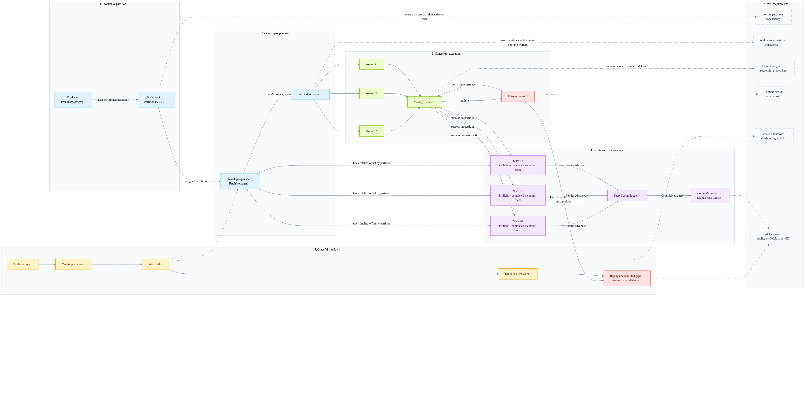
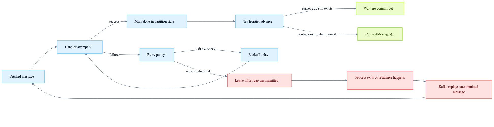
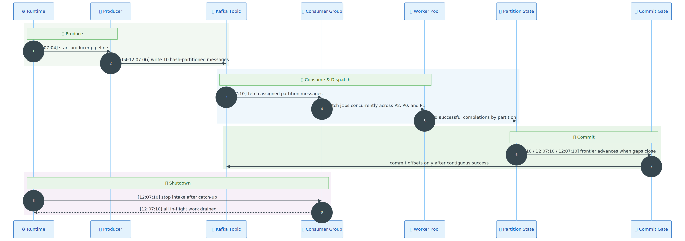
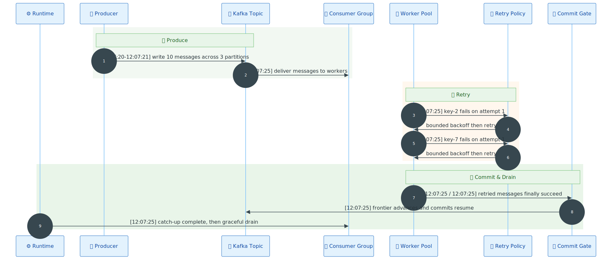
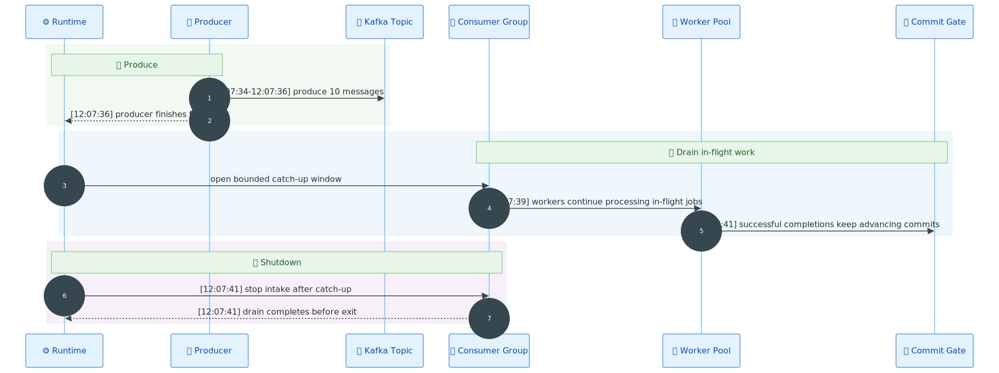
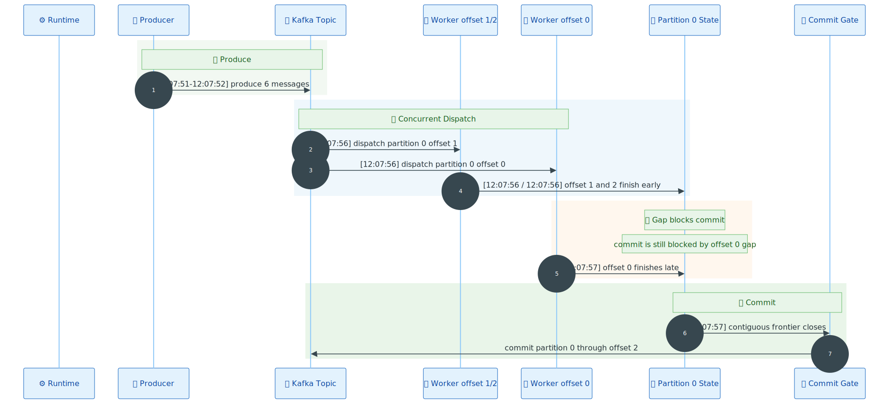
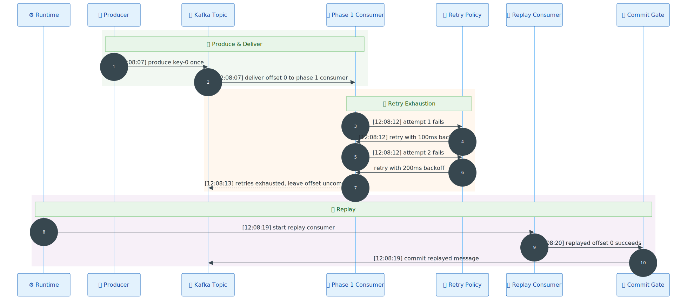
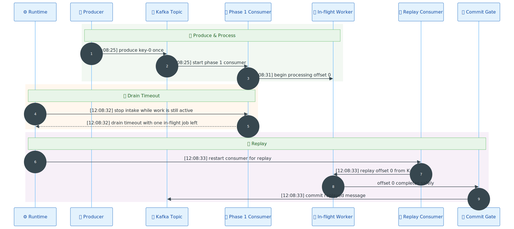
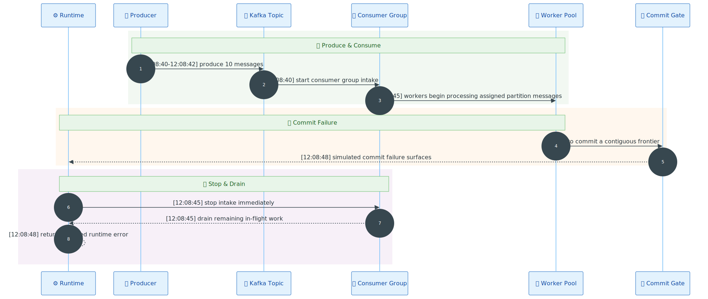

# Backend Interview Project

A production-minded Kafka consumer in Go that prioritizes **correctness under concurrency**, **explicit failure handling**, and **graceful shutdown**.

## Quick links

- **Original assignment brief**: [REQUIREMENT.md](./REQUIREMENT.md)
- **Detailed runtime evidence**: [docs/runtime-scenarios.md](./docs/runtime-scenarios.md)

## What this project proves

- **At-least-once delivery** through conservative commit behavior
- **Concurrency across partitions** and **within the same partition**
- **Commit-after-success** using a partition-local contiguous frontier
- **Explicit retries with backoff**
- **Graceful shutdown** with catch-up, intake stop, and in-flight drain
- **Replay-based safety** when retries are exhausted or shutdown leaves unfinished gaps

## Requirement coverage at a glance

| Requirement | Current implementation | Evidence |
| --- | --- | --- |
| Concurrent across partitions | Shared consumer-group reader dispatches assigned partitions into a shared worker pool | `baseline-success`, `graceful-drain` |
| Concurrent within same partition | Same-partition messages can fan out to multiple workers before commit | `out-of-order-frontier` |
| At-least-once | Unfinished or exhausted messages remain uncommitted and are replayable | `retry-exhausted-replay`, `shutdown-with-unfinished-gap` |
| Commit only after success | Worker success updates partition state first; only a contiguous frontier can commit | `baseline-success`, `out-of-order-frontier` |
| Explicit failure handling | Bounded retry/backoff plus conservative replay on exhaustion | `retry-and-recovery`, `retry-exhausted-replay` |
| Graceful shutdown | Producer completion leads to catch-up, intake stop, and in-flight drain | `graceful-drain`, `shutdown-with-unfinished-gap` |
| Conservative failure mode | Commit failure stops intake and returns an error instead of continuing blindly | `commit-failure-stops-intake` |

## System design

### Data flow overview

[](./docs/images/flowzap-data-flow-map.en.png)

This is the end-to-end path for the runnable implementation:

1. The producer writes hash-partitioned messages into Kafka.
2. A shared consumer-group reader fetches assigned messages with `FetchMessage()`.
3. Messages enter a buffered queue and fan out to concurrent workers.
4. Successful processing updates partition-local state.
5. Offsets are committed only when a contiguous frontier advances.
6. Producer completion triggers catch-up, then intake stop and in-flight drain.

### Failure path

[](./docs/images/flowzap-failure-path-map.en.png)

The important failure rule is simple: **failure never jumps straight to commit**.

- transient failures retry with backoff
- exhausted retries leave an intentional commit gap
- replay after restart or rebalance closes the safety loop

## Runtime evidence

The repository includes a full runtime evidence set generated from real runs:

- full scenario document: [docs/runtime-scenarios.md](./docs/runtime-scenarios.md)
- raw logs: [docs/runtime-logs/](./docs/runtime-logs/)

### Scenario coverage

#### `baseline-success` — [log](./docs/runtime-logs/baseline-success.log)
Success path, concurrent processing, safe commits, catch-up, drain.

[](./docs/images/runtime-scenarios/baseline-success.en.svg)

#### `retry-and-recovery` — [log](./docs/runtime-logs/retry-and-recovery.log)
Explicit retries and success-gated commit.

[](./docs/images/runtime-scenarios/retry-and-recovery.en.svg)

#### `graceful-drain` — [log](./docs/runtime-logs/graceful-drain.log)
Producer finishes first, consumer keeps draining in-flight work.

[](./docs/images/runtime-scenarios/graceful-drain.en.svg)

#### `out-of-order-frontier` — [log](./docs/runtime-logs/out-of-order-frontier.log)
Same-partition out-of-order completion without unsafe offset skipping.

[](./docs/images/runtime-scenarios/out-of-order-frontier.en.svg)

#### `retry-exhausted-replay` — [log](./docs/runtime-logs/retry-exhausted-replay.log)
Retry exhaustion leaves a replayable gap.

[](./docs/images/runtime-scenarios/retry-exhausted-replay.en.svg)

#### `shutdown-with-unfinished-gap` — [log](./docs/runtime-logs/shutdown-with-unfinished-gap.log)
Drain timeout leaves an unfinished gap that is replayed later.

[](./docs/images/runtime-scenarios/shutdown-with-unfinished-gap.en.svg)

#### `commit-failure-stops-intake` — [log](./docs/runtime-logs/commit-failure-stops-intake.log)
Commit failure stops intake and surfaces an expected error.

[](./docs/images/runtime-scenarios/commit-failure-stops-intake.en.svg)


## Run locally

### Application demo

```bash
go run ./cmd/app
```

### Full runtime evidence suite

```bash
go run ./e2e/scenarios
```

## Environment

- Docker
- Free ports:
  - `29092` — Kafka broker
  - `29093` — KRaft controller
- Go **1.25+**